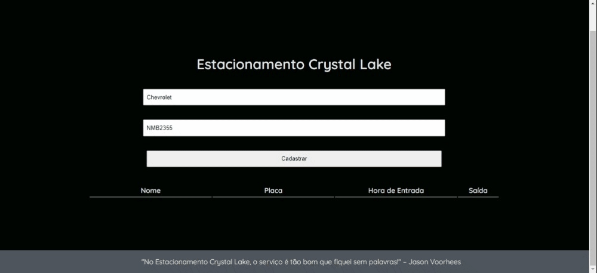

# Sistema de Controle de Estacionamento

Em um curso introdutório sobre TypeScript, ofertado pela [Digital Innovation One](https://web.dio.me/), o exercício final era criar um sistema de Controle de Estacionamento. Abaixo, o meu resultado:

